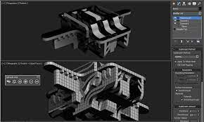

<!DOCTYPE html>
<html lang="en">
<head>
    <meta charset="UTF-8">
    <meta name="viewport" content="width=device-width, initial-scale=1.0">
    <title>MY PORTFOLIO</title>
    <link rel="preconnect" href="https://fonts.googleapis.com">
    <link rel="preconnect" href="https://fonts.gstatic.com" crossorigin>
    <link href="https://fonts.googleapis.com/css2?family=Poppins:wght@500;600&display=swap" rel="stylesheet">
    <link rel="preconnect" href="https://fonts.googleapis.com">
    <link rel="preconnect" href="https://fonts.gstatic.com" crossorigin>
    <link href="https://fonts.googleapis.com/css2?family=Poppins:wght@100&display=swap" rel="stylesheet">
    
    
    
</head>
<body>
    

        

            <nav>               
                    <a href="#header">Home</a>
                    <a href="#about">About</a>
                    <a href="#skills">Skills</a>
                    <a href="#interest">Interests</a>
                    <a href="#contact">Contact</a>
                    <a href="#video">demo</a>
            </nav>
            

                <h1>Welcome to my page!</h1>
                <h1>This is KIREETI BUSSA</h1>
                
web Developer

                
                

                    
                

            

            
        

    

    

        

            

                

                    <h1>ABOUT ME</h1>
                    

                        passionate about the website development, and beyond which can lead me to the notable accomplishments.I thrive on tackling challenges and bringing creative solutions to the table.outside of it, I loving watching solo games and medal tournaments. And, I have a curiosity of knowing about thing. 
    
                

                
            

        

    

    

        <h1 class="sub-title">MY SKILLS</h1>
        

            

                <i class="fa-solid fa-code"></i>
                <h2>Web Design</h2>
                
I have a creative flair for website Designing, skillfully blending aesthetics and functionality to create captivating online experiences.

            

            

                <i class="fa-solid fa-crop-simple"></i>
                <h2>UI / UX Designs</h2>
                
I excel in UI/UX designing, crafting seamless and visually appealing interfaces that prioritize user satisfaction and engagement.

            

        

        

            

                <i class="fa-brands fa-stumbleupon"></i>
                <h2>3D Modeling</h2>
                
I am considerate in 3D modeling, building models of virtual to look realistic with creativity and realistic

            

            

                <i class="fa-solid fa-vector-square"></i>
                <h2>Programming</h2>
                
I am good at c, c++  and  I also know bits of PYTHON and JAVA and also SQL

            

        

    

<!----------------portfolio----------------->

    

        

            <h1 class="sub-title">MY INTERESTS</h1>
            

                <h1></h1>
              
              
                
&nbsp;&nbsp;&nbsp;&nbsp;&nbsp;&nbsp;&nbsp;&nbsp;&nbsp;
                    I am pursuing a course in 3D modeling and there we use blender software to work on things, and has many opportunities to build a future out of it. Recently, I build up interest on Website designing and it helps me to understand the core notations of a website.
                
   
            

        

    

<!--------------------My accounts--------------------->

    

        <h1 class="sub-title">MY Accounts</h1>
        

            

                <a herf=""><i class="fa-brands fa-x-mail"></i></a>
                <h2>E-MAIL</h2>
                
my email acc, <a href="mailto:https://mail.google.com/mail/u/0/?tab=rm&ogbl#inbox">email</a>.

            

            

                <a herf=""><i class="fa-brands fa-github"></i></a>
                <h2>GITHUB</h2>
                
my github acc, <a href="https://github.com/Kireeti2808/Kireeti2808">github</a>.

            

            

                <a herf=""><i class="fa-brands fa-linkedin"></i></a>
                <h2>Linkedln</h2>
                
my Linkedln page, <a href="https://www.linkedin.com/in/kireeti-bussa-2339b6267/">Linkedln</a>.

            

        

    

        

    

<!--------------------contact--------------------->

    

        

            

                <h1 class="sub-title">Contact Me</h1>
                
If you want, You can contact me through

                
<i class="fa-solid fa-paper-plane"></i><a href="mailto:kireeti2808@gmail.com">email</a>

                
<i class="fa-solid fa-phone"></i>+91 9121366331

                

                    <a herf=""><i class="fa-brands fa-linkedin"></i></a>
                    <a herf=""><i class="fa-brands fa-x-twitter"></i></a>
                    <a herf=""><i class="fa-brands fa-x-github"></i></a>
                

            

                
            

                <form>
                    <input type="text" name="Name" placeholder="Your Name" required>
                    <input type="email" name="email" placeholder="Your Email" required>
                    <textarea name="message" rows="6" placeholder="Your message"></textarea>
                    <button type="Submit" class="btn">Submit</button>
                </form>
                

                    <video controls autoplay src="portfolio video.mp4" width="960" height="540"></video>
                

            

        

    

    

        
&copy; 2024 kireeti bussa. All rights reserved.

    

 
</body>
</html>
